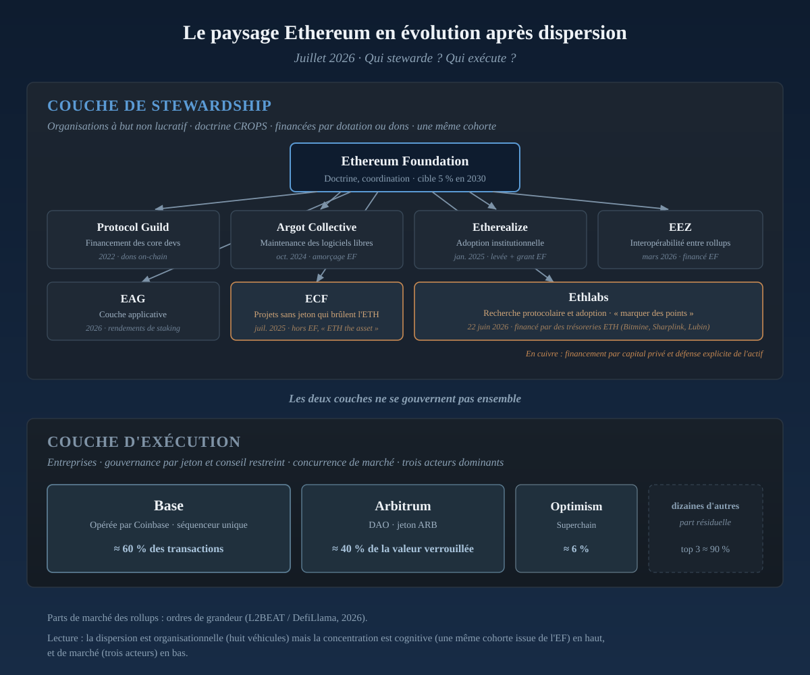

*First of a two-part reading.*

*The Ethereum Foundation's June 2026 announcements reveal a deeper transformation, one meant to preserve the principles that constitute the protocol.*

## June 2026: the center of gravity shifts

Some weeks compress several years of change. The week of June 18 to 23, 2026 is one of them. In a matter of days, the Ethereum Foundation published, or let others publish around it, a series of texts that read, taken one by one, like ordinary governance notices. Taken together, they trace a far more ambitious move, that of an institution methodically organizing its own withdrawal.

The chronology speaks for itself.

- On June 18, Hsiao-Wei Wang steps down from the executive leadership of the [Ethereum Foundation](https://blog.ethereum.org/2026/06/23/ef-structure).
- On June 23, the Foundation unveils its new structure. Fifty-four positions are cut, roughly 20 percent of the staff, the annual budget is cut by 40 percent, and one goal is now stated plainly: by 2030, to live like an endowment, spending no more than about 5 percent of its reserves a year, against nearly three times that before.
- The day before, on June 22, came a framework for assessing the organizations meant to grow outside the Foundation. In the same motion, [Ethlabs](https://ethlabs.org/) is born, a research lab whose funding no longer rests on a shared treasury but on private capital.
- Two further texts set the tone. In [a post on X](https://x.com/VitalikButerin/status/2069431500035023121), Vitalik Buterin owns the sacrifices this reorganization demands and restates his preference for a deliberately minimal protocol, in the spirit of Bitcoin. A few days earlier, [Trent Van Epps](https://x.com/trent_vanepps/status/2067593124398989551), a former Foundation member, estimated that roughly 30 million dollars in annual funding for protocol development could vanish, leaving a shortfall he puts near 20 million and opening a period of real strain in the months ahead.

No single one of these announcements is a historic event. Together, they tell a perfectly coherent story.

**Subtraction is not the byproduct of a budget constraint, it becomes a doctrine of government.**

The opposite objection deserves to be met rather than brushed aside. A treasury held mostly in ETH, far below its 2025 record, looks like a financial constraint, and cutting spending from 15 to 5 percent can be read as a survival response. But constraint and doctrine do not exclude each other: the constraint set the calendar, the doctrine set the form. The Foundation says as much itself in its June 23 post, which seeks to shield its work from "excessive disruption from short-term market movements": the market is named there as noise to neutralize, not as a compass. A mere austerity cure would have required neither an endowment model, nor a framework for evaluating spun-out structures, nor an organized dispersal of execution; it is that architecture, superfluous for saving money, that signs the doctrine.

For more than a decade, the Foundation served as the ecosystem's lender of last resort: it funded research, backed developers, sustained initiatives many of which would not have survived without it. Now it seeks less to grow the ecosystem than to secure its own permanence. Its ambition is no longer to be the engine of the system, but to remain its institutional conscience.

This shift in posture carries immediate consequences, and Buterin does not try to play them down.

- PSE, the long-standing team devoted to privacy and scaling research, ceases to exist as an autonomous entity.
- Devcon is set to grow more modest.
- The multi-client model, long regarded as one of the pillars of Ethereum's resilience through redundant implementations, gradually gives way to another vision of security, one leaning more on AI-assisted formal verification. This is not a mere budget saving, but a technological bet on the tools of tomorrow.
- Client funding changes too. The Client Incentive Program, fed by staking revenue, reached its term in April 2026 with no equivalent mechanism announced.
- And at the very moment the institution undertakes its deepest transformation since its founding, operational governance tightens sharply. After Wang's departure, Bastian Aue remains the sole executive director, while Aya Miyaguchi takes on a presidency turned mainly toward institutional relations.

These decisions can look like disengagement. In truth they reflect a different conception of what a founding institution is for. For years, the Foundation set out to build Ethereum. Now it sets out to avoid becoming its indispensable center.

The distinction is essential. An institution that claims to defend decentralization cannot indefinitely concentrate resources, talent, funding, and legitimacy within itself. As the protocol matures, the risk is no longer a lack of coordination, but the existence of a single point able to steer its evolution for good. In other words, the Foundation is trying to resolve a paradox it helped create: the more it succeeds, the more its own importance becomes a problem.

## CROPS: what the Foundation chooses to preserve

The term CROPS, for *censorship resistance, open source, privacy, security*, is not a loose list of desirable qualities. It is the core of the doctrine the Foundation means to defend. Resistance to censorship, open code, protection of privacy, and security become the criteria against which every change to the protocol is judged.

The principle beneath this doctrine is strikingly simple: whenever a service relies on an intermediary, there must always remain an alternative path, verifiable and accessible, that lets one do without it. Decentralization stops being a slogan and becomes a property one can examine, layer by layer, in the very architecture of the system.

This hierarchy deserves emphasis. CROPS does not aim first at adoption, or revenue, or speed of execution. It sets an order of values in which certain properties remain non-negotiable, even when they slow development or complicate the user experience. This is precisely where the restructuring takes on its meaning. An institution that recognizes itself as a potential point of centralization cannot remain indefinitely at the heart of the system without contradicting the principles it proclaims.

**The real coherence of this reorganization lies here: the Foundation applies to its own governance the principle of disintermediation it defends for Ethereum.**

The point, then, is not to give up power, but to change its nature. The doctrine stays centralized, because a doctrine is not produced by permanent consensus. Its execution, by contrast, disperses among autonomous organizations, free to experiment, to fail, or to succeed without binding the whole ecosystem.

## The new geography of stewards

When an institution withdraws, the space it leaves is never truly empty. It is filled at once by others. The whole question is to understand who they are, where they come from, and by what logic they organize. The landscape now taking shape around Ethereum is made of eight major structures, each with a different function.

  
The Ethereum landscape in July 2026: eight structures, one origin

  
The stewardship layer after the dispersion of the Ethereum Foundation.

  

  

Ethereum Foundation2015, restructured 2026

Doctrine, upstream research, coordinationHistorical treasury5% target by 2030subtraction, purityMiyaguchi (president), Aue (sole ED)

  

Protocol Guild2022

Neutral funding for core devsOn-chain donations4-year vestingmechanism over governanceVan Epps (ex-EF)

  

Argot CollectiveOct. 2024

Free and open-source maintenanceEF seed, 3 yearsquiet maintenanceEx-EF members

  

EtherealizeJan. 2025

Institutional adoption, tokenizationFundraise + EF grantWall Street outreachRaman, Ryan (ex-EF), Hummer

  

EEZMarch 2026

Interoperability across rollupsEF-fundedcross-chain coordinationGnosis, Zisk

  

ECFJuly 2025

Token-free projects that burn ETHPrivate capital, ETH donations"ETH the asset"Zak Cole (outside EF)

  

EAG2026

Application layerStaking yield to a fundextension to applicationsButerin, Xiao Feng

  

EthlabsJune 22, 2026

Protocol research and adoptionPrivate capital, ETH treasuriesexecution, impactDietrichs, Schwarz-Schilling, Monnot, Rudolf, Ma (all ex-EF)

  
<strong>In copper</strong>: the structures whose funding comes from private capital and whose discourse explicitly defends the asset.

*Two maps overlap. The first shows a stewardship community drawn largely from a single generation of researchers and developers. The second shows an execution space where the competitive dynamics of the market reassert themselves.*

This map reveals two regularities. The first is about people: behind the apparent diversity of organizations, the same trajectories keep recurring. Teams circulate, researchers reconvene, developers found new structures after working at the Foundation. The institution does not really disappear, it diffuses its culture through those who leave it. The second concerns modes of funding: as one moves away from the Foundation, the ground shifts from historical endowments and neutral mechanisms like on-chain donations to fundraises, private treasuries, and finally the large ETH holders themselves. The organizational periphery is also a financial periphery.

One exception qualifies this picture and is worth noting. The [Ethereum Community Foundation](https://ethcf.org/), launched in July 2025 by developer Zak Cole, does not come out of the Foundation and openly sets itself apart from it. Its motto, "ETH at 10,000 dollars is a requirement, not a meme," and its rule of funding only token-free projects that burn ETH, make it the most direct voice of the asset camp. The landscape, then, is not a single cohort but a central cohort surrounded by actors with sharper positions.

**The organization fragments, yet collective memory, networks of trust, and part of the cognitive power remain tightly concentrated.** Eight organizations now exist, and still they largely speak the same language.

The movement does not stop at eight. On July 1, a ninth structure was born, [Ethereum Institutional](https://www.ethereuminstitutional.org/mission), which presents itself as the front door for financial institutions into the ecosystem. Its three founders come from the Foundation's Enterprise team, and its initial backers overlap with those of Ethlabs: Bitmine, Sharplink, and Joe Lubin. **One more structure does not dilute the cohort, it confirms it: same origin, same capital, a new function.** The same day, the Foundation published a [case for Ethereum's neutrality for governments and institutions](https://blog.ethereum.org/2026/07/01/ethereum-for-institutions), a sign that it is stepping back from execution without giving up the narrative.

## The hidden map

This first map remains incomplete. It describes the actors who define, fund, or maintain the protocol, but leaves out where most of its economic activity now sits. The major rollups, [Base, Arbitrum, Optimism](https://l2beat.com) among them, do not belong to this first map. They draw a second one, largely autonomous. Where the earlier structures follow a logic of stewardship, of preservation and coordination, the rollups follow an entrepreneurial one. They have their own treasuries, their own tokens, their own governance councils, and their own interests.

Their economics obey very different dynamics. Organizations that came out of the Foundation live on funding, donations, or endowments. The rollups are locked in permanent competition for users, developers, and capital, and measure success in transaction volume, liquidity, market share. That difference explains the rapid concentration seen over the past two years. Between them, Base and Arbitrum hold close to 77 percent of the value locked on the main rollups. Base alone handles about 60 percent of daily transactions and is still operated by Coinbase through a single sequencer.

**Ethereum professes a philosophy of disintermediation while its daily economy rests more and more on powerful intermediaries.** This is not a contradiction but a matter of two timescales. In the long run, rollups are meant to inherit the properties of the underlying protocol, security, neutrality, censorship resistance. In the short run, they remain companies facing the ordinary constraints of the market, and they innovate fast precisely because they do not carry the weight of institutional neutrality alone.

It is in that gap that Buterin's shift in tone belongs, when he argues that a roadmap centered solely on rollups is no longer enough and that the base layer must regain a more ambitious capacity to scale. The position is not merely about engineering: it reflects the realization that a protocol cannot indefinitely delegate all of its value creation to layers that pursue their own economic logic. **The relationship between the Foundation and the rollups is no longer that of an architect and its builders, but of two centers of gravity learning to coexist, sometimes to cooperate, sometimes to compete.**

## Two narratives for one doctrine

This coexistence between the doctrinal center and its executing periphery makes sense only through the two cultures that inhabit it.

At first glance, the Foundation and Ethlabs tell two different stories. The first claims restraint: it protects principles, limits its spending, narrows its scope, and seeks to set Ethereum in the long term. The second claims execution: it promises to accelerate, to experiment, to deliver visible results, and to take on the bets the Foundation no longer wishes to carry. Ethlabs' founders push the metaphor all the way, describing the Foundation as the monastery, the Vatican of Ethereum, essential but not built to do everything, and themselves as the ones who put points on the board.

It would be too simple, though, to read this as opposition. The two structures share the same doctrine, both lay claim to CROPS. **What sets them apart is not their destination, but their idea of the road.** One holds that an institution's first responsibility is to preserve the conditions under which a future remains possible. The other holds that those conditions are worth nothing unless someone agrees to turn them into concrete results.

Behind that difference runs an older debate, one that pits two ways of thinking about the history of infrastructures. The first holds that a protocol becomes sovereign only when it is carried by an asset powerful enough to fund its development for the long haul: there would be no durable Ethereum without an ETH worth trillions. The second defends almost the opposite, that a genuinely neutral infrastructure must never organize the capture of value for itself, and that the more a protocol succeeds, the more it must accept that the wealth it creates flows to its ecosystem rather than to its own balance sheet.

For several years, Ethereum has been advancing along that fault line. By encouraging the growth of rollups, it has greatly improved its capacity to host activity, but that success came at a cost: part of the fees that once fed the base layer directly has moved to the layers above. The mechanism that destroys ETH still exists, but it now acts on a much narrower base. Ethereum has never been more used, its architecture has never been richer, and yet the link between the growth of the ecosystem and the valuation of its asset looks less direct than it once did. This is not necessarily a failure, it may be the price of an infrastructure reaching maturity. The railways did not capture all the wealth they made possible, and neither did the internet. The question that opens is therefore less financial than political: how to sustain an essential infrastructure when most of the value it makes possible is created elsewhere.

## What we know, and what remains uncertain

Two conclusions can now be treated as established. The first is that the current dispersion is not a string of independent initiatives but a strategy the Foundation has assumed itself: the structures emerging at its periphery extend a movement it prepared, funded, and, to some degree, organized. The second is that this architecture already exists: a Foundation refocused on doctrine, organizations specialized in maintenance, research, funding, or adoption, and competing companies charged with execution together sketch a coherent landscape, even if its balances remain fragile.

Other questions stay open. The sums actually committed by Ethlabs remain unknown, beyond an announced runway of two to three years. The mechanisms meant to guarantee its independence have not been made public. And no one can yet say whether this constellation will preserve, over time, the diversity it claims, or whether it will reproduce, in other forms, the concentrations it set out to avoid.

That may be the most important lesson of this sequence. Decentralization is often presented as a state one reaches once and for all. History shows the opposite: it is never secured, it is endlessly renegotiated. Each generation of institutions produces its own centers, then seeks to disperse them once they grow too powerful. The movement now unfolding around Ethereum belongs to that larger history, the history of organizations discovering that their greatest success can become their principal risk.

The week of June 2026, then, did not mark the end of a transition, but its beginning. A central institution chose to limit its own power in order to preserve the principles that justified its existence, and that choice gave rise to a landscape more distributed but also more complex, where no actor can any longer claim to embody the future of the protocol alone. The question is no longer whether the Foundation is withdrawing, but the one every institutional history ends up asking.

**When a center gives up exercising its power directly, who truly inherits what it leaves behind?**

Political, economic, and intellectual history has met this question many times before. It guides the second part of this reflection, [Who Captures the Void](/en/post/who-captures-the-void/).

---

## Sources

- Ethereum Foundation, *Ethereum Foundation: A New Chapter*, blog.ethereum.org, June 23, 2026 — [blog.ethereum.org](https://blog.ethereum.org/2026/06/23/ef-structure)
- Vitalik Buterin, on the tradeoffs of the restructuring and the minimal approach, X, June 2026 — [x.com/VitalikButerin](https://x.com/VitalikButerin/status/2069431500035023121)
- Trent Van Epps, *Succession After Subtraction*, June 2026 — [x.com/trent_vanepps](https://x.com/trent_vanepps/status/2067593124398989551)
- Ethlabs, *Announcing Ethlabs*, June 22, 2026 — [ethlabs.org](https://ethlabs.org/)
- Ethereum Community Foundation (Zak Cole), July 2025 — [ethcf.org](https://ethcf.org/)
- Protocol Guild — [protocolguild.org](https://www.protocolguild.org/) ; Ethereum Economic Zone — [eez.io](https://eez.io/)
- Rollup market data: [L2BEAT](https://l2beat.com) and [DeFiScan](https://www.defiscan.info)
